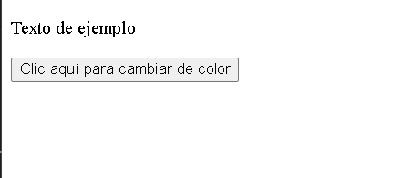
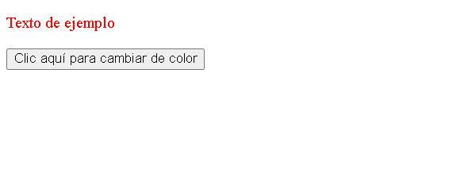

<div style="text-align: justify">

# JavaScript - Evento clic.

**Introducción**:

Los eventos son parte fundamental de la interacción entre el usuario y una página **WEB**. Permiten que el código `JavaScript` responda a acciones realizadas por el usuario o por el navegador. En `JavaScript`, los eventos son representados como objetos que contienen información sobre el evento que ha ocurrido. Los eventos pueden ser de diferentes tipos, como clics de ratón, pulsaciones de teclas, cambios de estado, cargas de página, etc. Cada tipo de evento puede estar asociado a un elemento `HTML` específico.

**Escucha de eventos**:

Para capturar y responder a un evento, debes *escuchar* dicho evento en un elemento específico del **DOM** (*Document Object Model*). Esto se hace mediante la fución: `addEventListener`.

**addEventListener**:

La función `addEventListener` es una herramienta esencial en `JavaScrit` para manejar eventos y crear interactividad en tus documentos **WEB**. Permite vincular funciones conocidas como *manejadores de eventos*, a elementos `HTML` específicos para responder a diferentes tipos  de acciones realizadas por el usuario.

**Ejemplo práctico**:

Para comenzarr con la práctica inicial necesitaremos un documento `HTML` con el archivo `JavaScript` vinculado; dentro del **body** agregaremos un texto que diga *Texto de práctica*, al cual asignaremos el atributo `class` con la declaración *textoEjemplo*, y además un botón que también deberá tener un atributo `class`, en este caso con la declaración *botonEjemplo*.

- Código HTML.

```HTML
<!DOCTYPE html>
<html>
    <head>
        <title>Document</title>
    </head>
    <body>
        <p class="textoEjemplo">Texto de ejemplo </p>
        <button class="botonEjemplo"> Clic aquí para cambiar de color </button>
        <script src="main.js"></script>
    </body>
</html>

```
Ahora continuaremos con la codificación en `JavaScript`, donde seleccionaremos los dos elementos `HTML` previamente creados y los almacenaremos en dos variables: 
Una llamada **botón** y la otra denominada **texto**.

```javascript
let boton = document.querySelector(".botonEjemplo");
let texto = document.querySelector(".textoEjemplo");
```

El objetivo de nuestro programa de ejemplo es lograr que, al hacer clic en el `boton`, el color del texto cambie; para ello utilizaremos nuestra variable `botón`, seguida de un punto, y luego la función `addEventlistener`.

```javascript
let boton = document.querySelector(".botonEjemplo");
let texto = document.querySelector(".textoEjemplo");

boton.addEventListener
```
Abriremos parántesis y, como primer argumento, colocaremos el evento que se escuchará; en este caso será un `click`, por lo que lo escribiremos entre comillas simples `'click'`, que se obtiene con la combinación `alt + 39` en código **ASCII**, indicando así la escucha del evento.

```javascript
let boton = document.querySelector(".botonEjemplo");
let texto = document.querySelector(".textoEjemplo");

boton.addEventListener('click'
```
Una vez llamado el evento, debemos agregar el segundo parámetro separado por una coma `,`. Este segundo parámetro en `addEventListener` será una función, que puede escribirse de distintas formas: funciones declarativas (*aquellas que requieren un nombre*), funciones de expresión o funciones flecha (*arrow function*). En este ejemplo usaremos una `función flecha`.

```javascript
let boton = document.querySelector(".botonEjemplo");
let texto = document.querySelector(".textoEjemplo");

boton.addEventListener('click', ()=>{

});

```

Solo nos resta modificar el estilo del texto dentro de nuestra función, la cual se ejecutará únicamente cuando el botón detecte el evento de un click sobre el elemento. Para hacerlo, llamaremos a la variable `texto`, seguida de un punto, luego al metodo `style`, nuevamente un punto y, a continuación, el atributo `color`, al cual le asignaremos con un igual `=` el color desaedo (*en inglés*), recordando que este debe ir entre comillas simples `''`.

```javascript
let boton = document.querySelector(".botonEjemplo");
let texto = document.querySelector(".textoEjemplo");

boton.addEventListener('click', ()=>{
texto.style.color = 'red';
});

```

*Vista documento `HTML`*:

<div style="text-align: center">



</div>

*Despues del evento clic*

<div style="text-align: center">



</div>

**Listado de eventos de `mouse`**

- `click` : Se activa cuando se hace clic en un elemento. 

<br>

- `dblclick` : Se activa cuando se hace doble clic en un elemento.

<br>

- `mousedown` : Se activa cuando se presiona un botón del ratón sobre un elemento.

<br>

- `mouseup` : Se activa cuando se suelta un botón del ratón sobre  un elemento

<br>

- `mouseover` : Se activa cuando el puntero del ratón se mueve sobre un elemento

- `mouseout` : Se activa cuando el puntero del ratón se mueve fuera de un elemento.

- `mousemove` : Se activa cuando el puntero del ratón se mueve mientras está sobre un elemento.

- `contextmenu` : Se activa cuando se hace clic con el botón derecho del ratón (*para abrir el menu contextual*).


</div>
